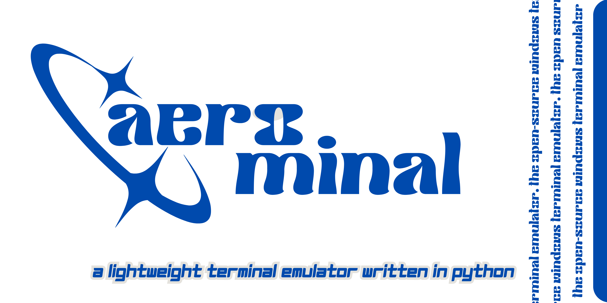

# [aerominal]
## 14.7× lighter then your average Chrome tab.
A modular, high-performance, lightweight, and highly customizable terminal emulator for Windows and Linux.

## Features
- **ANSI Color Support**: High-fidelity terminal colors with auto-contrast adjustment
- **Process Control**: Interrupt running commands with `Ctrl+C`
- **Internal Commands**: Native support for `clear` and `cls`
- **Smart Prompt**: Directory-aware input prompt (`~/path ❯`)
- **Visuals**: Themed entry cursor, 20+ built-in themes, and adjustable opacity
- **Stealth**: Automatically hides the Python console on Windows

## Quick Start
1. Install dependencies: `pip install -r requirements.txt`
2. Run: `python aerominal.py`

## Structure
- `src/core/`: Configuration, themes, and shell managers
- `src/ui/`: Terminal GUI components (Tkinter)
- `src/assets/`: UI resources and icons
- `aerominal.py`: Main entry point (redirector)

*Minimum requirements: Python 3.8+*

